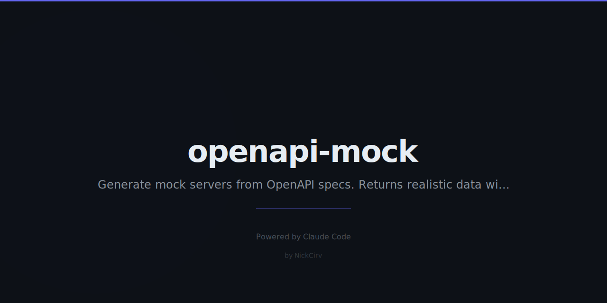

# openapi-mock
> Instant mock server from your OpenAPI spec. Realistic data. Zero config. Zero dependencies.

```bash
npx openapi-mock api.yaml
```

```
openapi-mock · api.yaml
━━━━━━━━━━━━━━━━━━━━━━━━━━━━━━━━━━━━
Mock server running at http://localhost:3000

Routes:
  GET    /users          → 200
  POST   /users          → 201
  GET    /users/{id}     → 200
  DELETE /users/{id}     → 204

Press r reload · l list · q quit
━━━━━━━━━━━━━━━━━━━━━━━━━━━━━━━━━━━━
```

## Commands
| Command | Description |
|---------|-------------|
| `openapi-mock <spec>` | Start mock from spec file |
| `--port N` | Port (default: 3000) |
| `--delay N` | Add N ms delay |
| `--seed N` | Reproducible random data |
| `--overrides <file>` | Custom responses |
| `--verbose` | Log every request |
| `--no-cors` | Disable CORS headers |

## Install
```bash
npx openapi-mock api.yaml
npm install -g openapi-mock
```

## Features

- Reads **OpenAPI 3.0** specs (YAML or JSON)
- Generates **realistic mock data** from JSON Schema
  - `string` formats: email, uuid, date, url, or lorem word
  - `integer`/`number` random in min/max range
  - `boolean` random
  - `array` 2-5 items
  - `object` recursively generates all properties
  - `enum` random valid value
  - `$ref` resolves and generates
- **Path param matching** — `{id}` -> regex capture group
- **Seeded random** — `--seed 42` for reproducible test data (LCG algorithm)
- **Override responses** via `--overrides overrides.json`
- **Interactive** — `r` reload spec, `l` list routes, `q` quit

## Example

```bash
npx openapi-mock api.yaml --verbose
```

---
**Zero dependencies** · **Node 18+** · Made by [NickCirv](https://github.com/NickCirv) · MIT
