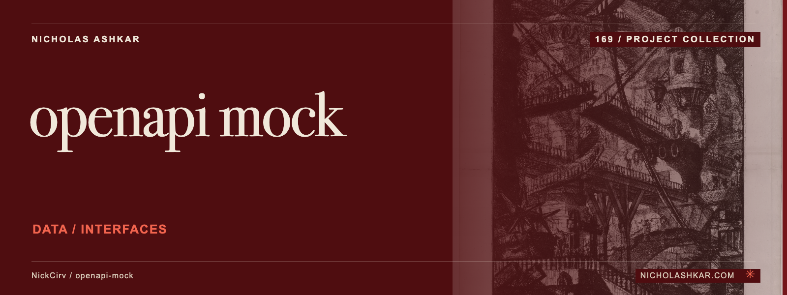

# openapi-mock

Start a development mock server from a local OpenAPI-style JSON or YAML document.

Builds routes from the spec and generates JSON values from a supported subset of schemas. Delays, response overrides, seeded randomness and request logging help exercise a client.


<a id="install"></a>

## Quickstart

Package runtime requirement: Node.js `>=20`. Git is needed to obtain this pinned source checkout.

```bash
git clone https://github.com/NickCirv/openapi-mock.git
cd openapi-mock
git checkout 580e869f8230f81410f047642465f21b194f7552
node index.js --help
```

This source-derived example has not been executed in this review. Help lists server options. Supply an existing local spec for the server example.


<a id="what-it-does"></a>

## Usage

```bash
node index.js api.json --port 8080 --seed 42 --verbose
node index.js api.json --overrides overrides.json --no-cors
```

The default port is 3000 and CORS headers are enabled. Overrides are keyed by method and path template, such as `GET /users`. Unmatched routes return a JSON 404. Interactive keys reload, list routes or quit.

[Command reference](docs/REFERENCE.md) covers arguments, modes and output controls.

## Behavior and limits

YAML parsing and schema generation are hand-written subsets, not complete OpenAPI/YAML validation. Only local `#/` references are resolved, and recursive generation has a depth cap. The listener does not specify a loopback host, so do not assume it is private to localhost. There is no authentication implementation. Generated responses are fixtures, not evidence that a real service follows the contract.

## Development

Declared package scripts:

| Script | Command |
| --- | --- |
| `test` | `node --test` |

The smoke test syntax-checks the entrypoint; it does not exercise CLI behavior or integrations.

## Research

[Source review and claim ledger](docs/RESEARCH.md) records revision `580e869f8230`, inspected files and verification gaps.

## License and attribution

Protected license and attribution files remain unchanged: [LICENSE](https://github.com/NickCirv/openapi-mock/blob/580e869f8230f81410f047642465f21b194f7552/LICENSE).

[Artwork credits](assets/nicholas-ashkar/CREDITS.md) · [Nicholas Ashkar — consulting](https://nicholashkar.com/#oxblood-contact)
